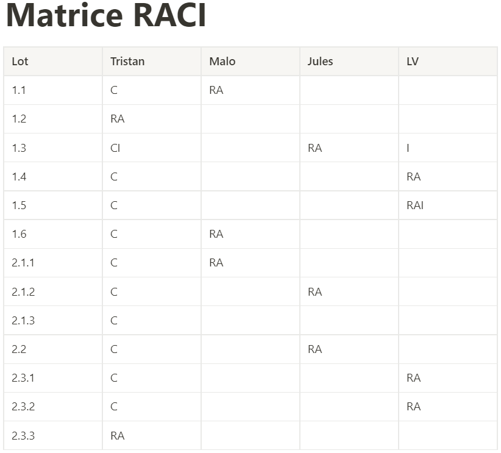

# Troisième CR

Date: December 17, 2021

Présents : LV, Jules, Malo,Tristan

# Ordre du jour

- Assignation des tâches
- Explications de l’intégration continue

## Explications de la CI/CD

Tristan c’est occupé de mettre en place une intégration en continu afin de pouvoir facilité le développement.
Le site est automatiquement mis à jour sur [Amplet](https://amplet.fr)

Afin de lancer cette mise à jour, il nous suffit d’aller sur la page du projet sur Gitlab, puis d’aller dans “Tags”, puis de créer un tag avec pour nom le numéro de la version.

## Assignation des tâches

Nous avons procédé à la création de la matrice RACI :

## Conclusion

Nous avons organisé une prochaine réunion le 23 Décembre (10h) afin de faire un point sur l’avancement des lots, l’uniformisation de la base de données et des schémas, ainsi que des éventuelles difficultés rencontrés.